# sepahead logo archive

This archive preserves earlier designs and captured design drafts.
The main repository README selects the active logo.
Archived artwork can contain superseded symbols or wording.
It does not establish current behavior, compatibility, authority, or release status.

[Manifest and exact source identities](manifest.json)

Each file retains its source bytes or an explicitly identified extraction from a historical portfolio SVG.
Extracted marks retain their source geometry, applicable styles, and referenced definitions.
No historical JavaScript was executed.
Dates identify the earliest captured source commit for those bytes, not necessarily the original design date.
Files use exact SHA-256 deduplication within this archive.

The archive excludes third-party marks, repeated platform icon sizes, and complete connection diagrams.
The manifest records any extraction gaps.

Select a preview to open the asset. Native SVG files retain scalable geometry.
Historical motion and accessibility behavior remain as originally stored.
The archive does not certify those older behaviors.

## CREBAIN

| Preview | Design | Source |
| --- | --- | --- |
| [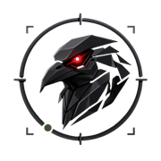](crebain/2026-06-22-001-crebain-logo-6070008b3e.png) | [2026-06-22-001-crebain-logo-6070008b3e](crebain/2026-06-22-001-crebain-logo-6070008b3e.png) | [6c1abeb3a4](https://github.com/sepahead/sepahead/blob/6c1abeb3a45290d02f9ccdce362e3dc34c2ec185/pics/crebain-logo.png) |
| [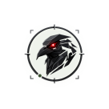](crebain/2026-07-04-002-profile-dark-d8413a6637.svg) | [2026-07-04-002-profile-dark-d8413a6637](crebain/2026-07-04-002-profile-dark-d8413a6637.svg) | [e43d9f07dc](https://github.com/sepahead/sepahead/blob/e43d9f07dc6ef3246230a8b61cf6b5ddf5058a07/assets/work-graph-dark.svg) |
|  | [2026-07-04-003-profile-light-0aee680384](crebain/2026-07-04-003-profile-light-0aee680384.svg) | [e43d9f07dc](https://github.com/sepahead/sepahead/blob/e43d9f07dc6ef3246230a8b61cf6b5ddf5058a07/assets/work-graph-light.svg) |
| [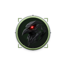](crebain/2026-07-12-004-profile-dark-9b4be6f69d.svg) | [2026-07-12-004-profile-dark-9b4be6f69d](crebain/2026-07-12-004-profile-dark-9b4be6f69d.svg) | [6c173a05f1](https://github.com/sepahead/sepahead/blob/6c173a05f1655eac25d7b3bf7f551bb0cec2aeeb/assets/work-graph-dark.svg) |
|  | [2026-07-12-005-profile-light-7ae9280eb7](crebain/2026-07-12-005-profile-light-7ae9280eb7.svg) | [6c173a05f1](https://github.com/sepahead/sepahead/blob/6c173a05f1655eac25d7b3bf7f551bb0cec2aeeb/assets/work-graph-light.svg) |
| [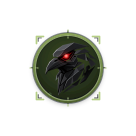](crebain/2026-07-12-006-profile-dark-2cf5d2c275.svg) | [2026-07-12-006-profile-dark-2cf5d2c275](crebain/2026-07-12-006-profile-dark-2cf5d2c275.svg) | [8efeeab875](https://github.com/sepahead/sepahead/blob/8efeeab875d59d692ce3f7388e160bb3dd2d0aac/assets/work-graph-dark.svg) |
|  | [2026-07-12-007-profile-light-1489308861](crebain/2026-07-12-007-profile-light-1489308861.svg) | [8efeeab875](https://github.com/sepahead/sepahead/blob/8efeeab875d59d692ce3f7388e160bb3dd2d0aac/assets/work-graph-light.svg) |
|  | [2026-07-12-008-profile-dark-d0051470b7](crebain/2026-07-12-008-profile-dark-d0051470b7.svg) | [ccd8062d1e](https://github.com/sepahead/sepahead/blob/ccd8062d1eacddbc4050d511ba24592d42e50501/assets/work-graph-dark.svg) |
|  | [2026-07-12-009-profile-light-73366a936f](crebain/2026-07-12-009-profile-light-73366a936f.svg) | [ccd8062d1e](https://github.com/sepahead/sepahead/blob/ccd8062d1eacddbc4050d511ba24592d42e50501/assets/work-graph-light.svg) |
| [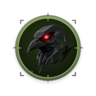](crebain/2026-07-12-010-profile-dark-a0d7bce9c0.svg) | [2026-07-12-010-profile-dark-a0d7bce9c0](crebain/2026-07-12-010-profile-dark-a0d7bce9c0.svg) | [400ad33a73](https://github.com/sepahead/sepahead/blob/400ad33a73e68615703adce98a6529d8ce8d96dd/assets/work-graph-dark.svg) |
|  | [2026-07-12-011-profile-light-47386febc1](crebain/2026-07-12-011-profile-light-47386febc1.svg) | [400ad33a73](https://github.com/sepahead/sepahead/blob/400ad33a73e68615703adce98a6529d8ce8d96dd/assets/work-graph-light.svg) |
|  | [2026-07-13-012-profile-dark-2675bbddef](crebain/2026-07-13-012-profile-dark-2675bbddef.svg) | [4675b232ed](https://github.com/sepahead/sepahead/blob/4675b232ed07bd2388c42a33b8696a3a374ce937/assets/work-graph-dark.svg) |
|  | [2026-07-13-013-profile-light-6f0f56bf61](crebain/2026-07-13-013-profile-light-6f0f56bf61.svg) | [4675b232ed](https://github.com/sepahead/sepahead/blob/4675b232ed07bd2388c42a33b8696a3a374ce937/assets/work-graph-light.svg) |
|  | [2026-07-26-014-crebain-logo-4b0bbe99e7](crebain/2026-07-26-014-crebain-logo-4b0bbe99e7.png) | [a6833b5d27](https://github.com/sepahead/sepahead/blob/a6833b5d27b7444efb94072a73ed021912933ea0/pics/crebain-logo.png) |
|  | [2026-07-26-015-profile-dark-367c973f4f](crebain/2026-07-26-015-profile-dark-367c973f4f.svg) | [a6833b5d27](https://github.com/sepahead/sepahead/blob/a6833b5d27b7444efb94072a73ed021912933ea0/assets/work-graph-dark.svg) |
|  | [2026-07-26-016-profile-light-9cf85b63b2](crebain/2026-07-26-016-profile-light-9cf85b63b2.svg) | [a6833b5d27](https://github.com/sepahead/sepahead/blob/a6833b5d27b7444efb94072a73ed021912933ea0/assets/work-graph-light.svg) |
|  | [2026-08-20-017-profile-dark-bfb81ad21f](crebain/2026-08-20-017-profile-dark-bfb81ad21f.svg) | [6f89d6c19d](https://github.com/sepahead/sepahead/blob/6f89d6c19d8b87556f66c91e73486163400ec8d2/assets/work-graph-dark.svg) |
|  | [2026-09-05-018-profile-dark-3f83737e52](crebain/2026-09-05-018-profile-dark-3f83737e52.svg) | [ed898bd827](https://github.com/sepahead/sepahead/blob/ed898bd827fd393b1a6262b48517a92c3b12d4b4/assets/work-graph-dark.svg) |
|  | [2026-09-05-019-profile-dark-64a8acd331](crebain/2026-09-05-019-profile-dark-64a8acd331.svg) | [8740c531cb](https://github.com/sepahead/sepahead/blob/8740c531cbb5cc9b74a74fe8e4d4018940700483/assets/work-graph-dark.svg) |
| [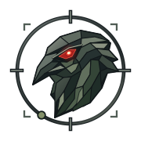](crebain/2026-09-05-020-crebain-mark-c705ff7496.svg) | [2026-09-05-020-crebain-mark-c705ff7496](crebain/2026-09-05-020-crebain-mark-c705ff7496.svg) | [4ef9ec9808](https://github.com/sepahead/sepahead/blob/4ef9ec980880f32aae27eac182448a7e70bdee3f/assets/crebain-mark.svg) |
|  | [2026-09-05-021-profile-dark-91149526ed](crebain/2026-09-05-021-profile-dark-91149526ed.svg) | [4ef9ec9808](https://github.com/sepahead/sepahead/blob/4ef9ec980880f32aae27eac182448a7e70bdee3f/assets/work-graph-dark.svg) |
|  | [2026-09-05-022-crebain-mark-8a2400c7c9](crebain/2026-09-05-022-crebain-mark-8a2400c7c9.svg) | [8f4b49873e](https://github.com/sepahead/sepahead/blob/8f4b49873e90a87d7e1b37bbb0fa44dc1899ce61/assets/crebain-mark.svg) |
|  | [2026-09-05-023-profile-dark-a3db2b1769](crebain/2026-09-05-023-profile-dark-a3db2b1769.svg) | [8f4b49873e](https://github.com/sepahead/sepahead/blob/8f4b49873e90a87d7e1b37bbb0fa44dc1899ce61/assets/work-graph-dark.svg) |
|  | [2026-09-06-024-crebain-mark-617a0c3708](crebain/2026-09-06-024-crebain-mark-617a0c3708.svg) | [8b0dc11c09](https://github.com/sepahead/sepahead/blob/8b0dc11c09db24a7d58d67ac37ac306a5cf79386/assets/crebain-mark.svg) |
|  | [2026-09-06-025-profile-dark-b655ce960d](crebain/2026-09-06-025-profile-dark-b655ce960d.svg) | [8b0dc11c09](https://github.com/sepahead/sepahead/blob/8b0dc11c09db24a7d58d67ac37ac306a5cf79386/assets/work-graph-dark.svg) |
| [](crebain/2026-09-06-026-crebain-mark-de60a96957.svg) | [2026-09-06-026-crebain-mark-de60a96957](crebain/2026-09-06-026-crebain-mark-de60a96957.svg) | [a3bcd355a9](https://github.com/sepahead/sepahead/blob/a3bcd355a9a1089ffd503836893f0f8a9f3f1e7d/assets/crebain-mark.svg) |
| [](crebain/2026-09-06-027-profile-dark-eaddb090fd.svg) | [2026-09-06-027-profile-dark-eaddb090fd](crebain/2026-09-06-027-profile-dark-eaddb090fd.svg) | [a3bcd355a9](https://github.com/sepahead/sepahead/blob/a3bcd355a9a1089ffd503836893f0f8a9f3f1e7d/assets/work-graph-dark.svg) |
| [](crebain/2026-09-06-028-crebain-mark-2129d32888.svg) | [2026-09-06-028-crebain-mark-2129d32888](crebain/2026-09-06-028-crebain-mark-2129d32888.svg) | [a1bc81fd70](https://github.com/sepahead/sepahead/blob/a1bc81fd7026c8aa6d1c58039542d6ca4dd85445/assets/crebain-mark.svg) |
| [](crebain/2026-09-06-029-profile-dark-30902aa5c9.svg) | [2026-09-06-029-profile-dark-30902aa5c9](crebain/2026-09-06-029-profile-dark-30902aa5c9.svg) | [a1bc81fd70](https://github.com/sepahead/sepahead/blob/a1bc81fd7026c8aa6d1c58039542d6ca4dd85445/assets/work-graph-dark.svg) |
| [](crebain/2026-09-06-030-crebain-mark-40d3ca7e4e.svg) | [2026-09-06-030-crebain-mark-40d3ca7e4e](crebain/2026-09-06-030-crebain-mark-40d3ca7e4e.svg) | [9db7aa36f1](https://github.com/sepahead/sepahead/blob/9db7aa36f11f2f92ffa52f1b7c416392836a4f6a/assets/crebain-mark.svg) |
| [](crebain/2026-09-06-031-profile-dark-e55871e12e.svg) | [2026-09-06-031-profile-dark-e55871e12e](crebain/2026-09-06-031-profile-dark-e55871e12e.svg) | [9db7aa36f1](https://github.com/sepahead/sepahead/blob/9db7aa36f11f2f92ffa52f1b7c416392836a4f6a/assets/work-graph-dark.svg) |
| [](crebain/2026-09-07-032-crebain-mark-2565e5d6d3.svg) | [2026-09-07-032-crebain-mark-2565e5d6d3](crebain/2026-09-07-032-crebain-mark-2565e5d6d3.svg) | [a9038ea0ee](https://github.com/sepahead/sepahead/blob/a9038ea0ee5a0735837e9958f1301507cb7c0864/assets/crebain-mark.svg) |
|  | [2026-09-07-033-profile-dark-2e6c51b4c8](crebain/2026-09-07-033-profile-dark-2e6c51b4c8.svg) | [a9038ea0ee](https://github.com/sepahead/sepahead/blob/a9038ea0ee5a0735837e9958f1301507cb7c0864/assets/work-graph-dark.svg) |
|  | [2026-09-07-034-crebain-mark-d070baa2be](crebain/2026-09-07-034-crebain-mark-d070baa2be.svg) | [4bcb7457ab](https://github.com/sepahead/sepahead/blob/4bcb7457ab2f55d856a9f52665ff18c0f186e063/assets/crebain-mark.svg) |
| [](crebain/2026-09-07-035-profile-dark-e9c6e51e99.svg) | [2026-09-07-035-profile-dark-e9c6e51e99](crebain/2026-09-07-035-profile-dark-e9c6e51e99.svg) | [4bcb7457ab](https://github.com/sepahead/sepahead/blob/4bcb7457ab2f55d856a9f52665ff18c0f186e063/assets/work-graph-dark.svg) |

## GALADRIEL

| Preview | Design | Source |
| --- | --- | --- |
|  | [2026-07-08-001-profile-dark-cd237f6b77](galadriel/2026-07-08-001-profile-dark-cd237f6b77.svg) | [876fb164e2](https://github.com/sepahead/sepahead/blob/876fb164e2b839096ca6cc33c930572be6672273/assets/work-graph-dark.svg) |
|  | [2026-07-08-002-profile-light-64c3cb319b](galadriel/2026-07-08-002-profile-light-64c3cb319b.svg) | [876fb164e2](https://github.com/sepahead/sepahead/blob/876fb164e2b839096ca6cc33c930572be6672273/assets/work-graph-light.svg) |
|  | [2026-07-08-003-profile-dark-3c90ec23ec](galadriel/2026-07-08-003-profile-dark-3c90ec23ec.svg) | [517db53062](https://github.com/sepahead/sepahead/blob/517db530626410c30335c4f30c61b59c54506686/assets/work-graph-dark.svg) |
|  | [2026-07-08-004-profile-light-f9224e925e](galadriel/2026-07-08-004-profile-light-f9224e925e.svg) | [517db53062](https://github.com/sepahead/sepahead/blob/517db530626410c30335c4f30c61b59c54506686/assets/work-graph-light.svg) |
|  | [2026-07-09-005-profile-dark-854f5a90e6](galadriel/2026-07-09-005-profile-dark-854f5a90e6.svg) | [a0ec5d3544](https://github.com/sepahead/sepahead/blob/a0ec5d35445b9a5341b68694fa898b3a87fb8a7d/assets/work-graph-dark.svg) |
|  | [2026-07-09-006-profile-light-7533648310](galadriel/2026-07-09-006-profile-light-7533648310.svg) | [a0ec5d3544](https://github.com/sepahead/sepahead/blob/a0ec5d35445b9a5341b68694fa898b3a87fb8a7d/assets/work-graph-light.svg) |
|  | [2026-07-10-007-profile-dark-b7d6392d1f](galadriel/2026-07-10-007-profile-dark-b7d6392d1f.svg) | [53625ad568](https://github.com/sepahead/sepahead/blob/53625ad5687d69a92ba09ec831ba269192191dba/assets/work-graph-dark.svg) |
|  | [2026-07-10-008-profile-light-5169c1e865](galadriel/2026-07-10-008-profile-light-5169c1e865.svg) | [53625ad568](https://github.com/sepahead/sepahead/blob/53625ad5687d69a92ba09ec831ba269192191dba/assets/work-graph-light.svg) |
|  | [2026-07-10-009-profile-dark-47fb8d3429](galadriel/2026-07-10-009-profile-dark-47fb8d3429.svg) | [52ad69ad9d](https://github.com/sepahead/sepahead/blob/52ad69ad9d4fb6c1995dbcc8a778232cbae015e5/assets/work-graph-dark.svg) |
|  | [2026-07-10-010-profile-light-071ff0860b](galadriel/2026-07-10-010-profile-light-071ff0860b.svg) | [52ad69ad9d](https://github.com/sepahead/sepahead/blob/52ad69ad9d4fb6c1995dbcc8a778232cbae015e5/assets/work-graph-light.svg) |
|  | [2026-07-10-011-profile-dark-68187cfb70](galadriel/2026-07-10-011-profile-dark-68187cfb70.svg) | [613a0bb239](https://github.com/sepahead/sepahead/blob/613a0bb239a0282b843a4058f4453b9828ff4bc4/assets/work-graph-dark.svg) |
|  | [2026-07-10-012-profile-light-73daf3bfac](galadriel/2026-07-10-012-profile-light-73daf3bfac.svg) | [613a0bb239](https://github.com/sepahead/sepahead/blob/613a0bb239a0282b843a4058f4453b9828ff4bc4/assets/work-graph-light.svg) |
|  | [2026-07-10-013-profile-dark-c8aa8521d9](galadriel/2026-07-10-013-profile-dark-c8aa8521d9.svg) | [7611abed0b](https://github.com/sepahead/sepahead/blob/7611abed0b67e4d7ffcc896033e188a7544620f8/assets/work-graph-dark.svg) |
|  | [2026-07-10-014-profile-light-41cf385317](galadriel/2026-07-10-014-profile-light-41cf385317.svg) | [7611abed0b](https://github.com/sepahead/sepahead/blob/7611abed0b67e4d7ffcc896033e188a7544620f8/assets/work-graph-light.svg) |
|  | [2026-07-10-015-profile-dark-9bf7c04ae4](galadriel/2026-07-10-015-profile-dark-9bf7c04ae4.svg) | [4d7894398e](https://github.com/sepahead/sepahead/blob/4d7894398e451f8c2833d2a5bcc87831d1b5345f/assets/work-graph-dark.svg) |
|  | [2026-07-10-016-profile-light-726a745664](galadriel/2026-07-10-016-profile-light-726a745664.svg) | [4d7894398e](https://github.com/sepahead/sepahead/blob/4d7894398e451f8c2833d2a5bcc87831d1b5345f/assets/work-graph-light.svg) |
|  | [2026-07-10-017-profile-dark-d02eaad08a](galadriel/2026-07-10-017-profile-dark-d02eaad08a.svg) | [dabc5b7cec](https://github.com/sepahead/sepahead/blob/dabc5b7cece7007ac098907db43cd7d8a43935d4/assets/work-graph-dark.svg) |
|  | [2026-07-10-018-profile-light-1a06b0d7d7](galadriel/2026-07-10-018-profile-light-1a06b0d7d7.svg) | [dabc5b7cec](https://github.com/sepahead/sepahead/blob/dabc5b7cece7007ac098907db43cd7d8a43935d4/assets/work-graph-light.svg) |
|  | [2026-07-10-019-profile-dark-af2c898a0d](galadriel/2026-07-10-019-profile-dark-af2c898a0d.svg) | [60b62678b5](https://github.com/sepahead/sepahead/blob/60b62678b51a869c2271f7ecc44dff18012bdc29/assets/work-graph-dark.svg) |
|  | [2026-07-10-020-profile-light-d9b74bb2cf](galadriel/2026-07-10-020-profile-light-d9b74bb2cf.svg) | [60b62678b5](https://github.com/sepahead/sepahead/blob/60b62678b51a869c2271f7ecc44dff18012bdc29/assets/work-graph-light.svg) |
|  | [2026-07-10-021-profile-dark-842b5d9cbf](galadriel/2026-07-10-021-profile-dark-842b5d9cbf.svg) | [91cb5b4a59](https://github.com/sepahead/sepahead/blob/91cb5b4a5917d8419403e09019b7d9c0fbafddba/assets/work-graph-dark.svg) |
|  | [2026-07-10-022-profile-light-3a84f10e47](galadriel/2026-07-10-022-profile-light-3a84f10e47.svg) | [91cb5b4a59](https://github.com/sepahead/sepahead/blob/91cb5b4a5917d8419403e09019b7d9c0fbafddba/assets/work-graph-light.svg) |
|  | [2026-07-10-023-profile-dark-64628a929b](galadriel/2026-07-10-023-profile-dark-64628a929b.svg) | [df0279f942](https://github.com/sepahead/sepahead/blob/df0279f94294bbd14c8effbb3bcf74c36220315d/assets/work-graph-dark.svg) |
|  | [2026-07-10-024-profile-light-87f340a5dd](galadriel/2026-07-10-024-profile-light-87f340a5dd.svg) | [df0279f942](https://github.com/sepahead/sepahead/blob/df0279f94294bbd14c8effbb3bcf74c36220315d/assets/work-graph-light.svg) |
|  | [2026-07-11-025-profile-dark-039471ab6c](galadriel/2026-07-11-025-profile-dark-039471ab6c.svg) | [2ebe00a6d7](https://github.com/sepahead/sepahead/blob/2ebe00a6d70e085e6def60b921009ba71e56a919/assets/work-graph-dark.svg) |
|  | [2026-07-11-026-profile-light-c308ce5f8d](galadriel/2026-07-11-026-profile-light-c308ce5f8d.svg) | [2ebe00a6d7](https://github.com/sepahead/sepahead/blob/2ebe00a6d70e085e6def60b921009ba71e56a919/assets/work-graph-light.svg) |
|  | [2026-07-11-027-profile-dark-16db34714e](galadriel/2026-07-11-027-profile-dark-16db34714e.svg) | [5ae9135fef](https://github.com/sepahead/sepahead/blob/5ae9135fefd0e31d91ef552141f590bbacd5e0ac/assets/work-graph-dark.svg) |
|  | [2026-07-11-028-profile-light-4a9acd89f1](galadriel/2026-07-11-028-profile-light-4a9acd89f1.svg) | [5ae9135fef](https://github.com/sepahead/sepahead/blob/5ae9135fefd0e31d91ef552141f590bbacd5e0ac/assets/work-graph-light.svg) |
|  | [2026-07-12-029-profile-dark-03c7d21d94](galadriel/2026-07-12-029-profile-dark-03c7d21d94.svg) | [b2d19ccdd3](https://github.com/sepahead/sepahead/blob/b2d19ccdd3d19856664480dd3e14095cc307a4ba/assets/work-graph-dark.svg) |
|  | [2026-07-12-030-profile-light-311034cf64](galadriel/2026-07-12-030-profile-light-311034cf64.svg) | [b2d19ccdd3](https://github.com/sepahead/sepahead/blob/b2d19ccdd3d19856664480dd3e14095cc307a4ba/assets/work-graph-light.svg) |
|  | [2026-07-12-031-profile-dark-8a4b7d8e9d](galadriel/2026-07-12-031-profile-dark-8a4b7d8e9d.svg) | [6c173a05f1](https://github.com/sepahead/sepahead/blob/6c173a05f1655eac25d7b3bf7f551bb0cec2aeeb/assets/work-graph-dark.svg) |
|  | [2026-07-12-032-profile-light-f8ae556723](galadriel/2026-07-12-032-profile-light-f8ae556723.svg) | [6c173a05f1](https://github.com/sepahead/sepahead/blob/6c173a05f1655eac25d7b3bf7f551bb0cec2aeeb/assets/work-graph-light.svg) |
|  | [2026-07-13-033-profile-dark-28fbfc22a7](galadriel/2026-07-13-033-profile-dark-28fbfc22a7.svg) | [68ec2fb461](https://github.com/sepahead/sepahead/blob/68ec2fb461a19e6f5aa81da5f4ee7a2bac54a643/assets/work-graph-dark.svg) |
|  | [2026-07-13-034-profile-light-bf0e552608](galadriel/2026-07-13-034-profile-light-bf0e552608.svg) | [68ec2fb461](https://github.com/sepahead/sepahead/blob/68ec2fb461a19e6f5aa81da5f4ee7a2bac54a643/assets/work-graph-light.svg) |
|  | [2026-08-20-035-profile-dark-0e753d30da](galadriel/2026-08-20-035-profile-dark-0e753d30da.svg) | [6f89d6c19d](https://github.com/sepahead/sepahead/blob/6f89d6c19d8b87556f66c91e73486163400ec8d2/assets/work-graph-dark.svg) |
|  | [2026-09-05-036-profile-dark-3e6026d63d](galadriel/2026-09-05-036-profile-dark-3e6026d63d.svg) | [ed898bd827](https://github.com/sepahead/sepahead/blob/ed898bd827fd393b1a6262b48517a92c3b12d4b4/assets/work-graph-dark.svg) |
|  | [2026-09-05-037-profile-dark-136983fc0f](galadriel/2026-09-05-037-profile-dark-136983fc0f.svg) | [8740c531cb](https://github.com/sepahead/sepahead/blob/8740c531cbb5cc9b74a74fe8e4d4018940700483/assets/work-graph-dark.svg) |
|  | [2026-09-07-038-galadriel-mark-d3f4ea5c77](galadriel/2026-09-07-038-galadriel-mark-d3f4ea5c77.svg) | [4bcb7457ab](https://github.com/sepahead/sepahead/blob/4bcb7457ab2f55d856a9f52665ff18c0f186e063/assets/galadriel-mark.svg) |
|  | [2026-09-07-039-profile-dark-ae3c990989](galadriel/2026-09-07-039-profile-dark-ae3c990989.svg) | [4bcb7457ab](https://github.com/sepahead/sepahead/blob/4bcb7457ab2f55d856a9f52665ff18c0f186e063/assets/work-graph-dark.svg) |

## HALDIR

| Preview | Design | Source |
| --- | --- | --- |
|  | [2026-07-12-001-profile-dark-b1ae301f48](haldir/2026-07-12-001-profile-dark-b1ae301f48.svg) | [7936e237e1](https://github.com/sepahead/sepahead/blob/7936e237e1b340717954d72eb75c679ca6e06a91/assets/work-graph-dark.svg) |
|  | [2026-07-12-002-profile-light-9c676d4e53](haldir/2026-07-12-002-profile-light-9c676d4e53.svg) | [7936e237e1](https://github.com/sepahead/sepahead/blob/7936e237e1b340717954d72eb75c679ca6e06a91/assets/work-graph-light.svg) |
|  | [2026-07-12-003-profile-dark-b4471b3741](haldir/2026-07-12-003-profile-dark-b4471b3741.svg) | [b2d19ccdd3](https://github.com/sepahead/sepahead/blob/b2d19ccdd3d19856664480dd3e14095cc307a4ba/assets/work-graph-dark.svg) |
|  | [2026-07-12-004-profile-light-53ca0a3b70](haldir/2026-07-12-004-profile-light-53ca0a3b70.svg) | [b2d19ccdd3](https://github.com/sepahead/sepahead/blob/b2d19ccdd3d19856664480dd3e14095cc307a4ba/assets/work-graph-light.svg) |
|  | [2026-07-12-005-profile-dark-bb44906075](haldir/2026-07-12-005-profile-dark-bb44906075.svg) | [8efeeab875](https://github.com/sepahead/sepahead/blob/8efeeab875d59d692ce3f7388e160bb3dd2d0aac/assets/work-graph-dark.svg) |
|  | [2026-07-12-006-profile-light-b1bd7eb008](haldir/2026-07-12-006-profile-light-b1bd7eb008.svg) | [8efeeab875](https://github.com/sepahead/sepahead/blob/8efeeab875d59d692ce3f7388e160bb3dd2d0aac/assets/work-graph-light.svg) |
|  | [2026-07-12-007-profile-dark-fe9c54c21a](haldir/2026-07-12-007-profile-dark-fe9c54c21a.svg) | [400ad33a73](https://github.com/sepahead/sepahead/blob/400ad33a73e68615703adce98a6529d8ce8d96dd/assets/work-graph-dark.svg) |
|  | [2026-07-12-008-profile-light-2ec25fdf5e](haldir/2026-07-12-008-profile-light-2ec25fdf5e.svg) | [400ad33a73](https://github.com/sepahead/sepahead/blob/400ad33a73e68615703adce98a6529d8ce8d96dd/assets/work-graph-light.svg) |
|  | [2026-07-13-009-profile-dark-a0cc78313c](haldir/2026-07-13-009-profile-dark-a0cc78313c.svg) | [4675b232ed](https://github.com/sepahead/sepahead/blob/4675b232ed07bd2388c42a33b8696a3a374ce937/assets/work-graph-dark.svg) |
|  | [2026-07-13-010-profile-light-5adb62fa5f](haldir/2026-07-13-010-profile-light-5adb62fa5f.svg) | [4675b232ed](https://github.com/sepahead/sepahead/blob/4675b232ed07bd2388c42a33b8696a3a374ce937/assets/work-graph-light.svg) |
|  | [2026-07-13-011-profile-dark-6d4bb508fc](haldir/2026-07-13-011-profile-dark-6d4bb508fc.svg) | [d7bfa2cfe5](https://github.com/sepahead/sepahead/blob/d7bfa2cfe5ee10aa7ceec9c067744699d267e380/assets/work-graph-dark.svg) |
|  | [2026-07-13-012-profile-light-7e0d996599](haldir/2026-07-13-012-profile-light-7e0d996599.svg) | [d7bfa2cfe5](https://github.com/sepahead/sepahead/blob/d7bfa2cfe5ee10aa7ceec9c067744699d267e380/assets/work-graph-light.svg) |
|  | [2026-07-13-013-profile-dark-69a8da8352](haldir/2026-07-13-013-profile-dark-69a8da8352.svg) | [ffee3bbfdb](https://github.com/sepahead/sepahead/blob/ffee3bbfdbe5a50a0ffc7af176dadd1b15dd822c/assets/work-graph-dark.svg) |
|  | [2026-07-13-014-profile-light-95fb95b3fd](haldir/2026-07-13-014-profile-light-95fb95b3fd.svg) | [ffee3bbfdb](https://github.com/sepahead/sepahead/blob/ffee3bbfdbe5a50a0ffc7af176dadd1b15dd822c/assets/work-graph-light.svg) |
|  | [2026-07-13-015-profile-dark-76d8e93d64](haldir/2026-07-13-015-profile-dark-76d8e93d64.svg) | [68ec2fb461](https://github.com/sepahead/sepahead/blob/68ec2fb461a19e6f5aa81da5f4ee7a2bac54a643/assets/work-graph-dark.svg) |
|  | [2026-07-13-016-profile-light-95aef0f2c8](haldir/2026-07-13-016-profile-light-95aef0f2c8.svg) | [68ec2fb461](https://github.com/sepahead/sepahead/blob/68ec2fb461a19e6f5aa81da5f4ee7a2bac54a643/assets/work-graph-light.svg) |
|  | [2026-08-20-017-profile-dark-f7a74826c3](haldir/2026-08-20-017-profile-dark-f7a74826c3.svg) | [6f89d6c19d](https://github.com/sepahead/sepahead/blob/6f89d6c19d8b87556f66c91e73486163400ec8d2/assets/work-graph-dark.svg) |
|  | [2026-09-05-018-profile-dark-f14f7a038e](haldir/2026-09-05-018-profile-dark-f14f7a038e.svg) | [ed898bd827](https://github.com/sepahead/sepahead/blob/ed898bd827fd393b1a6262b48517a92c3b12d4b4/assets/work-graph-dark.svg) |
|  | [2026-09-05-019-profile-dark-52f13d9070](haldir/2026-09-05-019-profile-dark-52f13d9070.svg) | [8740c531cb](https://github.com/sepahead/sepahead/blob/8740c531cbb5cc9b74a74fe8e4d4018940700483/assets/work-graph-dark.svg) |
|  | [2026-09-07-020-solid-cyberpunk-draft-aad8c7c6fa](haldir/2026-09-07-020-solid-cyberpunk-draft-aad8c7c6fa.svg) | Unpublished draft |
|  | [2026-09-07-021-haldir-mark-54f71a47aa](haldir/2026-09-07-021-haldir-mark-54f71a47aa.svg) | [a9038ea0ee](https://github.com/sepahead/sepahead/blob/a9038ea0ee5a0735837e9958f1301507cb7c0864/assets/haldir-mark.svg) |
|  | [2026-09-07-022-profile-dark-e1b383d28f](haldir/2026-09-07-022-profile-dark-e1b383d28f.svg) | [a9038ea0ee](https://github.com/sepahead/sepahead/blob/a9038ea0ee5a0735837e9958f1301507cb7c0864/assets/work-graph-dark.svg) |
|  | [2026-09-07-023-haldir-mark-9d22646179](haldir/2026-09-07-023-haldir-mark-9d22646179.svg) | [4bcb7457ab](https://github.com/sepahead/sepahead/blob/4bcb7457ab2f55d856a9f52665ff18c0f186e063/assets/haldir-mark.svg) |
|  | [2026-09-07-024-profile-dark-1c4e3464e3](haldir/2026-09-07-024-profile-dark-1c4e3464e3.svg) | [4bcb7457ab](https://github.com/sepahead/sepahead/blob/4bcb7457ab2f55d856a9f52665ff18c0f186e063/assets/work-graph-dark.svg) |
|  | [2026-09-07-025-haldir-mark-75be469ab1](haldir/2026-09-07-025-haldir-mark-75be469ab1.svg) | [39a2a621dc](https://github.com/sepahead/sepahead/blob/39a2a621dc002775b98dcca94ffa40ecd93f0663/assets/haldir-mark.svg) |
|  | [2026-09-07-026-profile-dark-d237cde2d0](haldir/2026-09-07-026-profile-dark-d237cde2d0.svg) | [39a2a621dc](https://github.com/sepahead/sepahead/blob/39a2a621dc002775b98dcca94ffa40ecd93f0663/assets/work-graph-dark.svg) |

## MANWE

| Preview | Design | Source |
| --- | --- | --- |
|  | [2026-07-07-001-profile-dark-e58c9e0720](manwe/2026-07-07-001-profile-dark-e58c9e0720.svg) | [fe550c6c17](https://github.com/sepahead/sepahead/blob/fe550c6c17b09f383a3f668205d6f29edf158588/assets/work-graph-dark.svg) |
|  | [2026-07-07-002-profile-light-f06fa8907b](manwe/2026-07-07-002-profile-light-f06fa8907b.svg) | [fe550c6c17](https://github.com/sepahead/sepahead/blob/fe550c6c17b09f383a3f668205d6f29edf158588/assets/work-graph-light.svg) |
|  | [2026-07-10-003-profile-dark-1c795c39a9](manwe/2026-07-10-003-profile-dark-1c795c39a9.svg) | [53625ad568](https://github.com/sepahead/sepahead/blob/53625ad5687d69a92ba09ec831ba269192191dba/assets/work-graph-dark.svg) |
|  | [2026-07-10-004-profile-light-7f24dee39d](manwe/2026-07-10-004-profile-light-7f24dee39d.svg) | [53625ad568](https://github.com/sepahead/sepahead/blob/53625ad5687d69a92ba09ec831ba269192191dba/assets/work-graph-light.svg) |
|  | [2026-07-10-005-profile-dark-ccf2bba85a](manwe/2026-07-10-005-profile-dark-ccf2bba85a.svg) | [52ad69ad9d](https://github.com/sepahead/sepahead/blob/52ad69ad9d4fb6c1995dbcc8a778232cbae015e5/assets/work-graph-dark.svg) |
|  | [2026-07-10-006-profile-light-f185abb006](manwe/2026-07-10-006-profile-light-f185abb006.svg) | [52ad69ad9d](https://github.com/sepahead/sepahead/blob/52ad69ad9d4fb6c1995dbcc8a778232cbae015e5/assets/work-graph-light.svg) |
|  | [2026-07-10-007-profile-dark-f49bab047f](manwe/2026-07-10-007-profile-dark-f49bab047f.svg) | [32a11d43bb](https://github.com/sepahead/sepahead/blob/32a11d43bb57f500d940ee3c8daf2bcfd63b4f5e/assets/work-graph-dark.svg) |
|  | [2026-07-10-008-profile-light-df0cc4a181](manwe/2026-07-10-008-profile-light-df0cc4a181.svg) | [32a11d43bb](https://github.com/sepahead/sepahead/blob/32a11d43bb57f500d940ee3c8daf2bcfd63b4f5e/assets/work-graph-light.svg) |
|  | [2026-07-12-009-profile-dark-21a60a38ed](manwe/2026-07-12-009-profile-dark-21a60a38ed.svg) | [6c173a05f1](https://github.com/sepahead/sepahead/blob/6c173a05f1655eac25d7b3bf7f551bb0cec2aeeb/assets/work-graph-dark.svg) |
|  | [2026-07-12-010-profile-light-f264b69b32](manwe/2026-07-12-010-profile-light-f264b69b32.svg) | [6c173a05f1](https://github.com/sepahead/sepahead/blob/6c173a05f1655eac25d7b3bf7f551bb0cec2aeeb/assets/work-graph-light.svg) |
|  | [2026-07-12-011-profile-dark-21cd83d818](manwe/2026-07-12-011-profile-dark-21cd83d818.svg) | [8efeeab875](https://github.com/sepahead/sepahead/blob/8efeeab875d59d692ce3f7388e160bb3dd2d0aac/assets/work-graph-dark.svg) |
|  | [2026-07-12-012-profile-light-d46aa1bb5b](manwe/2026-07-12-012-profile-light-d46aa1bb5b.svg) | [8efeeab875](https://github.com/sepahead/sepahead/blob/8efeeab875d59d692ce3f7388e160bb3dd2d0aac/assets/work-graph-light.svg) |
|  | [2026-07-12-013-profile-dark-1ed97cbcee](manwe/2026-07-12-013-profile-dark-1ed97cbcee.svg) | [9b122bb9e7](https://github.com/sepahead/sepahead/blob/9b122bb9e767613abbba34526f9af6e7f18dbdb5/assets/work-graph-dark.svg) |
|  | [2026-07-12-014-profile-light-34f78cd989](manwe/2026-07-12-014-profile-light-34f78cd989.svg) | [9b122bb9e7](https://github.com/sepahead/sepahead/blob/9b122bb9e767613abbba34526f9af6e7f18dbdb5/assets/work-graph-light.svg) |
|  | [2026-07-12-015-profile-dark-fcb6b8feae](manwe/2026-07-12-015-profile-dark-fcb6b8feae.svg) | [b2f012141a](https://github.com/sepahead/sepahead/blob/b2f012141aa6191bd281b4af5bd71b5776715b4b/assets/work-graph-dark.svg) |
|  | [2026-07-12-016-profile-light-ff6375632e](manwe/2026-07-12-016-profile-light-ff6375632e.svg) | [b2f012141a](https://github.com/sepahead/sepahead/blob/b2f012141aa6191bd281b4af5bd71b5776715b4b/assets/work-graph-light.svg) |
|  | [2026-07-12-017-profile-dark-e23724c6c4](manwe/2026-07-12-017-profile-dark-e23724c6c4.svg) | [7d15b710f6](https://github.com/sepahead/sepahead/blob/7d15b710f674da20d81121b9efba5b927d9684f2/assets/work-graph-dark.svg) |
|  | [2026-07-12-018-profile-light-61b7a5d6c9](manwe/2026-07-12-018-profile-light-61b7a5d6c9.svg) | [7d15b710f6](https://github.com/sepahead/sepahead/blob/7d15b710f674da20d81121b9efba5b927d9684f2/assets/work-graph-light.svg) |
|  | [2026-07-12-019-profile-dark-bb9f5bd3a4](manwe/2026-07-12-019-profile-dark-bb9f5bd3a4.svg) | [994b1f0d04](https://github.com/sepahead/sepahead/blob/994b1f0d044e13c1699071168b3a4c8f0dcecfe8/assets/work-graph-dark.svg) |
|  | [2026-07-12-020-profile-light-d01eb243c1](manwe/2026-07-12-020-profile-light-d01eb243c1.svg) | [994b1f0d04](https://github.com/sepahead/sepahead/blob/994b1f0d044e13c1699071168b3a4c8f0dcecfe8/assets/work-graph-light.svg) |
|  | [2026-07-12-021-profile-dark-102603e9c3](manwe/2026-07-12-021-profile-dark-102603e9c3.svg) | [ccd8062d1e](https://github.com/sepahead/sepahead/blob/ccd8062d1eacddbc4050d511ba24592d42e50501/assets/work-graph-dark.svg) |
|  | [2026-07-12-022-profile-light-27ace80a2f](manwe/2026-07-12-022-profile-light-27ace80a2f.svg) | [ccd8062d1e](https://github.com/sepahead/sepahead/blob/ccd8062d1eacddbc4050d511ba24592d42e50501/assets/work-graph-light.svg) |
|  | [2026-07-12-023-profile-dark-ee667ae443](manwe/2026-07-12-023-profile-dark-ee667ae443.svg) | [2b3b320ab6](https://github.com/sepahead/sepahead/blob/2b3b320ab6be41bbee76d4a4812ba9f1ff9cb1c0/assets/work-graph-dark.svg) |
|  | [2026-07-12-024-profile-light-99594c822a](manwe/2026-07-12-024-profile-light-99594c822a.svg) | [2b3b320ab6](https://github.com/sepahead/sepahead/blob/2b3b320ab6be41bbee76d4a4812ba9f1ff9cb1c0/assets/work-graph-light.svg) |
|  | [2026-07-13-025-profile-dark-a60b2fe6cd](manwe/2026-07-13-025-profile-dark-a60b2fe6cd.svg) | [f43e6cc8ce](https://github.com/sepahead/sepahead/blob/f43e6cc8cefdc5d136967b86cda983474b68f57f/assets/work-graph-dark.svg) |
|  | [2026-07-13-026-profile-light-694f247788](manwe/2026-07-13-026-profile-light-694f247788.svg) | [f43e6cc8ce](https://github.com/sepahead/sepahead/blob/f43e6cc8cefdc5d136967b86cda983474b68f57f/assets/work-graph-light.svg) |
|  | [2026-07-13-027-profile-dark-538c00147c](manwe/2026-07-13-027-profile-dark-538c00147c.svg) | [d7bfa2cfe5](https://github.com/sepahead/sepahead/blob/d7bfa2cfe5ee10aa7ceec9c067744699d267e380/assets/work-graph-dark.svg) |
|  | [2026-07-13-028-profile-light-5e17572ef7](manwe/2026-07-13-028-profile-light-5e17572ef7.svg) | [d7bfa2cfe5](https://github.com/sepahead/sepahead/blob/d7bfa2cfe5ee10aa7ceec9c067744699d267e380/assets/work-graph-light.svg) |
|  | [2026-07-13-029-profile-dark-9f6b9e3fa9](manwe/2026-07-13-029-profile-dark-9f6b9e3fa9.svg) | [219741fdc5](https://github.com/sepahead/sepahead/blob/219741fdc576ad5ba86a21016a323254d8973489/assets/work-graph-dark.svg) |
|  | [2026-07-13-030-profile-light-ad5ac5e0a1](manwe/2026-07-13-030-profile-light-ad5ac5e0a1.svg) | [219741fdc5](https://github.com/sepahead/sepahead/blob/219741fdc576ad5ba86a21016a323254d8973489/assets/work-graph-light.svg) |
|  | [2026-07-26-031-profile-dark-58b7914020](manwe/2026-07-26-031-profile-dark-58b7914020.svg) | [a6833b5d27](https://github.com/sepahead/sepahead/blob/a6833b5d27b7444efb94072a73ed021912933ea0/assets/work-graph-dark.svg) |
|  | [2026-07-26-032-profile-light-820b368d55](manwe/2026-07-26-032-profile-light-820b368d55.svg) | [a6833b5d27](https://github.com/sepahead/sepahead/blob/a6833b5d27b7444efb94072a73ed021912933ea0/assets/work-graph-light.svg) |
|  | [2026-08-20-033-profile-dark-79336c17b2](manwe/2026-08-20-033-profile-dark-79336c17b2.svg) | [6f89d6c19d](https://github.com/sepahead/sepahead/blob/6f89d6c19d8b87556f66c91e73486163400ec8d2/assets/work-graph-dark.svg) |
|  | [2026-09-05-034-profile-dark-b4f1887887](manwe/2026-09-05-034-profile-dark-b4f1887887.svg) | [ed898bd827](https://github.com/sepahead/sepahead/blob/ed898bd827fd393b1a6262b48517a92c3b12d4b4/assets/work-graph-dark.svg) |
|  | [2026-09-05-035-profile-dark-3405b80242](manwe/2026-09-05-035-profile-dark-3405b80242.svg) | [8740c531cb](https://github.com/sepahead/sepahead/blob/8740c531cbb5cc9b74a74fe8e4d4018940700483/assets/work-graph-dark.svg) |

## NCP

| Preview | Design | Source |
| --- | --- | --- |
|  | [2026-07-04-001-profile-dark-f72cabe648](ncp/2026-07-04-001-profile-dark-f72cabe648.svg) | [e43d9f07dc](https://github.com/sepahead/sepahead/blob/e43d9f07dc6ef3246230a8b61cf6b5ddf5058a07/assets/work-graph-dark.svg) |
|  | [2026-07-04-002-profile-light-029cbb4241](ncp/2026-07-04-002-profile-light-029cbb4241.svg) | [e43d9f07dc](https://github.com/sepahead/sepahead/blob/e43d9f07dc6ef3246230a8b61cf6b5ddf5058a07/assets/work-graph-light.svg) |
|  | [2026-07-10-003-profile-dark-a009fcbcf5](ncp/2026-07-10-003-profile-dark-a009fcbcf5.svg) | [f0375ae458](https://github.com/sepahead/sepahead/blob/f0375ae4588442e39e9fb28c28387170a831cadd/assets/work-graph-dark.svg) |
|  | [2026-07-10-004-profile-light-146277a7ef](ncp/2026-07-10-004-profile-light-146277a7ef.svg) | [f0375ae458](https://github.com/sepahead/sepahead/blob/f0375ae4588442e39e9fb28c28387170a831cadd/assets/work-graph-light.svg) |
|  | [2026-07-10-005-profile-dark-cc4149151c](ncp/2026-07-10-005-profile-dark-cc4149151c.svg) | [32a11d43bb](https://github.com/sepahead/sepahead/blob/32a11d43bb57f500d940ee3c8daf2bcfd63b4f5e/assets/work-graph-dark.svg) |
| [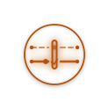](ncp/2026-07-10-006-profile-light-575baf848d.svg) | [2026-07-10-006-profile-light-575baf848d](ncp/2026-07-10-006-profile-light-575baf848d.svg) | [32a11d43bb](https://github.com/sepahead/sepahead/blob/32a11d43bb57f500d940ee3c8daf2bcfd63b4f5e/assets/work-graph-light.svg) |
|  | [2026-07-10-007-profile-dark-88c8b5ecfb](ncp/2026-07-10-007-profile-dark-88c8b5ecfb.svg) | [79fbe3d1a3](https://github.com/sepahead/sepahead/blob/79fbe3d1a32c6dc61db1d018a3807a878c28cfea/assets/work-graph-dark.svg) |
|  | [2026-07-10-008-profile-light-d52d0a411e](ncp/2026-07-10-008-profile-light-d52d0a411e.svg) | [79fbe3d1a3](https://github.com/sepahead/sepahead/blob/79fbe3d1a32c6dc61db1d018a3807a878c28cfea/assets/work-graph-light.svg) |
|  | [2026-07-12-009-profile-dark-bc656fe5ee](ncp/2026-07-12-009-profile-dark-bc656fe5ee.svg) | [6ba67be275](https://github.com/sepahead/sepahead/blob/6ba67be275f563bb53a5827ba9eabf49ff75d123/assets/work-graph-dark.svg) |
|  | [2026-07-12-010-profile-light-af6f85e49a](ncp/2026-07-12-010-profile-light-af6f85e49a.svg) | [6ba67be275](https://github.com/sepahead/sepahead/blob/6ba67be275f563bb53a5827ba9eabf49ff75d123/assets/work-graph-light.svg) |
|  | [2026-07-13-011-profile-dark-4174f739ea](ncp/2026-07-13-011-profile-dark-4174f739ea.svg) | [f43e6cc8ce](https://github.com/sepahead/sepahead/blob/f43e6cc8cefdc5d136967b86cda983474b68f57f/assets/work-graph-dark.svg) |
|  | [2026-07-13-012-profile-light-a3179b6e06](ncp/2026-07-13-012-profile-light-a3179b6e06.svg) | [f43e6cc8ce](https://github.com/sepahead/sepahead/blob/f43e6cc8cefdc5d136967b86cda983474b68f57f/assets/work-graph-light.svg) |
|  | [2026-07-13-013-profile-dark-bacb76c76d](ncp/2026-07-13-013-profile-dark-bacb76c76d.svg) | [219741fdc5](https://github.com/sepahead/sepahead/blob/219741fdc576ad5ba86a21016a323254d8973489/assets/work-graph-dark.svg) |
|  | [2026-07-13-014-profile-light-c9376982fe](ncp/2026-07-13-014-profile-light-c9376982fe.svg) | [219741fdc5](https://github.com/sepahead/sepahead/blob/219741fdc576ad5ba86a21016a323254d8973489/assets/work-graph-light.svg) |
|  | [2026-08-20-015-profile-dark-35f38c39f0](ncp/2026-08-20-015-profile-dark-35f38c39f0.svg) | [6f89d6c19d](https://github.com/sepahead/sepahead/blob/6f89d6c19d8b87556f66c91e73486163400ec8d2/assets/work-graph-dark.svg) |
|  | [2026-08-20-016-profile-dark-0d23687278](ncp/2026-08-20-016-profile-dark-0d23687278.svg) | [ba26a24aac](https://github.com/sepahead/sepahead/blob/ba26a24aacc53ea1d745716ee3b8091b686497c3/assets/work-graph-dark.svg) |
|  | [2026-08-20-017-profile-dark-b27f3329ae](ncp/2026-08-20-017-profile-dark-b27f3329ae.svg) | [4d5ac22dac](https://github.com/sepahead/sepahead/blob/4d5ac22dac823140d6257a821fd316f3e20356d4/assets/work-graph-dark.svg) |
|  | [2026-08-20-018-profile-dark-268efd1c9a](ncp/2026-08-20-018-profile-dark-268efd1c9a.svg) | [42bc7b290a](https://github.com/sepahead/sepahead/blob/42bc7b290a33cbf317398cefcd99ef6609228312/assets/work-graph-dark.svg) |
|  | [2026-09-05-019-profile-dark-b313c28e8d](ncp/2026-09-05-019-profile-dark-b313c28e8d.svg) | [ed898bd827](https://github.com/sepahead/sepahead/blob/ed898bd827fd393b1a6262b48517a92c3b12d4b4/assets/work-graph-dark.svg) |
|  | [2026-09-05-020-profile-dark-5a068d3338](ncp/2026-09-05-020-profile-dark-5a068d3338.svg) | [8740c531cb](https://github.com/sepahead/sepahead/blob/8740c531cbb5cc9b74a74fe8e4d4018940700483/assets/work-graph-dark.svg) |
|  | [2026-09-07-021-ncp-mark-6d175501f8](ncp/2026-09-07-021-ncp-mark-6d175501f8.svg) | [21bf33bf1f](https://github.com/sepahead/sepahead/blob/21bf33bf1fde663e007433dd129e3093243de682/assets/ncp-mark.svg) |
|  | [2026-09-07-022-ncp-mark-09e8843fb7](ncp/2026-09-07-022-ncp-mark-09e8843fb7.svg) | [a9038ea0ee](https://github.com/sepahead/sepahead/blob/a9038ea0ee5a0735837e9958f1301507cb7c0864/assets/ncp-mark.svg) |
|  | [2026-09-07-023-profile-dark-8dae5f8ba9](ncp/2026-09-07-023-profile-dark-8dae5f8ba9.svg) | [a9038ea0ee](https://github.com/sepahead/sepahead/blob/a9038ea0ee5a0735837e9958f1301507cb7c0864/assets/work-graph-dark.svg) |
|  | [2026-09-07-024-ncp-mark-6fa03f6532](ncp/2026-09-07-024-ncp-mark-6fa03f6532.svg) | [4bcb7457ab](https://github.com/sepahead/sepahead/blob/4bcb7457ab2f55d856a9f52665ff18c0f186e063/assets/ncp-mark.svg) |
|  | [2026-09-07-025-profile-dark-8951acf890](ncp/2026-09-07-025-profile-dark-8951acf890.svg) | [4bcb7457ab](https://github.com/sepahead/sepahead/blob/4bcb7457ab2f55d856a9f52665ff18c0f186e063/assets/work-graph-dark.svg) |
|  | [2026-09-07-026-ncp-mark-7138b51591](ncp/2026-09-07-026-ncp-mark-7138b51591.svg) | [39a2a621dc](https://github.com/sepahead/sepahead/blob/39a2a621dc002775b98dcca94ffa40ecd93f0663/assets/ncp-mark.svg) |
|  | [2026-09-07-027-profile-dark-f93ac1c321](ncp/2026-09-07-027-profile-dark-f93ac1c321.svg) | [39a2a621dc](https://github.com/sepahead/sepahead/blob/39a2a621dc002775b98dcca94ffa40ecd93f0663/assets/work-graph-dark.svg) |
|  | [2026-09-07-028-profile-dark-4c07906e6d](ncp/2026-09-07-028-profile-dark-4c07906e6d.svg) | [21bf33bf1f](https://github.com/sepahead/sepahead/blob/21bf33bf1fde663e007433dd129e3093243de682/assets/work-graph-dark.svg) |

## PRISOMA

| Preview | Design | Source |
| --- | --- | --- |
|  | [2026-07-04-001-profile-dark-25ddaa3884](prisoma/2026-07-04-001-profile-dark-25ddaa3884.svg) | [e43d9f07dc](https://github.com/sepahead/sepahead/blob/e43d9f07dc6ef3246230a8b61cf6b5ddf5058a07/assets/work-graph-dark.svg) |
|  | [2026-07-04-002-profile-light-41edfbffc3](prisoma/2026-07-04-002-profile-light-41edfbffc3.svg) | [e43d9f07dc](https://github.com/sepahead/sepahead/blob/e43d9f07dc6ef3246230a8b61cf6b5ddf5058a07/assets/work-graph-light.svg) |
| [](prisoma/2026-07-10-003-profile-dark-a744c7aa5b.svg) | [2026-07-10-003-profile-dark-a744c7aa5b](prisoma/2026-07-10-003-profile-dark-a744c7aa5b.svg) | [f0375ae458](https://github.com/sepahead/sepahead/blob/f0375ae4588442e39e9fb28c28387170a831cadd/assets/work-graph-dark.svg) |
|  | [2026-07-10-004-profile-light-bf3ce9275f](prisoma/2026-07-10-004-profile-light-bf3ce9275f.svg) | [f0375ae458](https://github.com/sepahead/sepahead/blob/f0375ae4588442e39e9fb28c28387170a831cadd/assets/work-graph-light.svg) |
|  | [2026-07-10-005-profile-dark-6a384de64e](prisoma/2026-07-10-005-profile-dark-6a384de64e.svg) | [32a11d43bb](https://github.com/sepahead/sepahead/blob/32a11d43bb57f500d940ee3c8daf2bcfd63b4f5e/assets/work-graph-dark.svg) |
|  | [2026-07-10-006-profile-light-49860a11da](prisoma/2026-07-10-006-profile-light-49860a11da.svg) | [32a11d43bb](https://github.com/sepahead/sepahead/blob/32a11d43bb57f500d940ee3c8daf2bcfd63b4f5e/assets/work-graph-light.svg) |
|  | [2026-07-10-007-profile-dark-35ed5c4126](prisoma/2026-07-10-007-profile-dark-35ed5c4126.svg) | [79fbe3d1a3](https://github.com/sepahead/sepahead/blob/79fbe3d1a32c6dc61db1d018a3807a878c28cfea/assets/work-graph-dark.svg) |
|  | [2026-07-10-008-profile-light-f7e3481d3c](prisoma/2026-07-10-008-profile-light-f7e3481d3c.svg) | [79fbe3d1a3](https://github.com/sepahead/sepahead/blob/79fbe3d1a32c6dc61db1d018a3807a878c28cfea/assets/work-graph-light.svg) |
|  | [2026-07-12-009-profile-dark-d8d0abdab8](prisoma/2026-07-12-009-profile-dark-d8d0abdab8.svg) | [8efeeab875](https://github.com/sepahead/sepahead/blob/8efeeab875d59d692ce3f7388e160bb3dd2d0aac/assets/work-graph-dark.svg) |
|  | [2026-07-12-010-profile-light-25adaa2057](prisoma/2026-07-12-010-profile-light-25adaa2057.svg) | [8efeeab875](https://github.com/sepahead/sepahead/blob/8efeeab875d59d692ce3f7388e160bb3dd2d0aac/assets/work-graph-light.svg) |
|  | [2026-07-12-011-profile-dark-e33da2e58e](prisoma/2026-07-12-011-profile-dark-e33da2e58e.svg) | [588c79fb14](https://github.com/sepahead/sepahead/blob/588c79fb146c84e1e609e998d69e8221cdb2988b/assets/work-graph-dark.svg) |
|  | [2026-07-12-012-profile-light-4ae5ccb3e8](prisoma/2026-07-12-012-profile-light-4ae5ccb3e8.svg) | [588c79fb14](https://github.com/sepahead/sepahead/blob/588c79fb146c84e1e609e998d69e8221cdb2988b/assets/work-graph-light.svg) |
|  | [2026-07-12-013-profile-dark-90264e2b76](prisoma/2026-07-12-013-profile-dark-90264e2b76.svg) | [55a8b5bc1c](https://github.com/sepahead/sepahead/blob/55a8b5bc1c403806644606f507d5d248fea44cab/assets/work-graph-dark.svg) |
|  | [2026-07-12-014-profile-light-7d4970876e](prisoma/2026-07-12-014-profile-light-7d4970876e.svg) | [55a8b5bc1c](https://github.com/sepahead/sepahead/blob/55a8b5bc1c403806644606f507d5d248fea44cab/assets/work-graph-light.svg) |
|  | [2026-07-12-015-profile-dark-b74f22478a](prisoma/2026-07-12-015-profile-dark-b74f22478a.svg) | [b2f012141a](https://github.com/sepahead/sepahead/blob/b2f012141aa6191bd281b4af5bd71b5776715b4b/assets/work-graph-dark.svg) |
|  | [2026-07-12-016-profile-light-9a9dc96d3c](prisoma/2026-07-12-016-profile-light-9a9dc96d3c.svg) | [b2f012141a](https://github.com/sepahead/sepahead/blob/b2f012141aa6191bd281b4af5bd71b5776715b4b/assets/work-graph-light.svg) |
|  | [2026-07-12-017-profile-dark-f626af97d3](prisoma/2026-07-12-017-profile-dark-f626af97d3.svg) | [994b1f0d04](https://github.com/sepahead/sepahead/blob/994b1f0d044e13c1699071168b3a4c8f0dcecfe8/assets/work-graph-dark.svg) |
|  | [2026-07-12-018-profile-light-9ade80ee27](prisoma/2026-07-12-018-profile-light-9ade80ee27.svg) | [994b1f0d04](https://github.com/sepahead/sepahead/blob/994b1f0d044e13c1699071168b3a4c8f0dcecfe8/assets/work-graph-light.svg) |
|  | [2026-07-12-019-profile-dark-bd90b8df71](prisoma/2026-07-12-019-profile-dark-bd90b8df71.svg) | [cab4238614](https://github.com/sepahead/sepahead/blob/cab4238614f14862c3da1feae5dc3f281f53ab03/assets/work-graph-dark.svg) |
|  | [2026-07-12-020-profile-light-33c6873ce6](prisoma/2026-07-12-020-profile-light-33c6873ce6.svg) | [cab4238614](https://github.com/sepahead/sepahead/blob/cab4238614f14862c3da1feae5dc3f281f53ab03/assets/work-graph-light.svg) |
|  | [2026-07-12-021-profile-dark-6f62b426c5](prisoma/2026-07-12-021-profile-dark-6f62b426c5.svg) | [400ad33a73](https://github.com/sepahead/sepahead/blob/400ad33a73e68615703adce98a6529d8ce8d96dd/assets/work-graph-dark.svg) |
|  | [2026-07-12-022-profile-light-5be0b6be0e](prisoma/2026-07-12-022-profile-light-5be0b6be0e.svg) | [400ad33a73](https://github.com/sepahead/sepahead/blob/400ad33a73e68615703adce98a6529d8ce8d96dd/assets/work-graph-light.svg) |
|  | [2026-07-13-023-profile-dark-83b6cb52cb](prisoma/2026-07-13-023-profile-dark-83b6cb52cb.svg) | [f43e6cc8ce](https://github.com/sepahead/sepahead/blob/f43e6cc8cefdc5d136967b86cda983474b68f57f/assets/work-graph-dark.svg) |
|  | [2026-07-13-024-profile-light-ac0e3c4a17](prisoma/2026-07-13-024-profile-light-ac0e3c4a17.svg) | [f43e6cc8ce](https://github.com/sepahead/sepahead/blob/f43e6cc8cefdc5d136967b86cda983474b68f57f/assets/work-graph-light.svg) |
|  | [2026-07-13-025-profile-dark-f5d90a99e6](prisoma/2026-07-13-025-profile-dark-f5d90a99e6.svg) | [68ec2fb461](https://github.com/sepahead/sepahead/blob/68ec2fb461a19e6f5aa81da5f4ee7a2bac54a643/assets/work-graph-dark.svg) |
|  | [2026-07-13-026-profile-light-fca587dd9d](prisoma/2026-07-13-026-profile-light-fca587dd9d.svg) | [68ec2fb461](https://github.com/sepahead/sepahead/blob/68ec2fb461a19e6f5aa81da5f4ee7a2bac54a643/assets/work-graph-light.svg) |
|  | [2026-07-26-027-profile-dark-f838c9ff68](prisoma/2026-07-26-027-profile-dark-f838c9ff68.svg) | [a6833b5d27](https://github.com/sepahead/sepahead/blob/a6833b5d27b7444efb94072a73ed021912933ea0/assets/work-graph-dark.svg) |
|  | [2026-07-26-028-profile-light-868d94be9c](prisoma/2026-07-26-028-profile-light-868d94be9c.svg) | [a6833b5d27](https://github.com/sepahead/sepahead/blob/a6833b5d27b7444efb94072a73ed021912933ea0/assets/work-graph-light.svg) |
|  | [2026-08-20-029-profile-dark-c9d9746c64](prisoma/2026-08-20-029-profile-dark-c9d9746c64.svg) | [6f89d6c19d](https://github.com/sepahead/sepahead/blob/6f89d6c19d8b87556f66c91e73486163400ec8d2/assets/work-graph-dark.svg) |
|  | [2026-09-05-030-profile-dark-ac01c79c49](prisoma/2026-09-05-030-profile-dark-ac01c79c49.svg) | [ed898bd827](https://github.com/sepahead/sepahead/blob/ed898bd827fd393b1a6262b48517a92c3b12d4b4/assets/work-graph-dark.svg) |
|  | [2026-09-05-031-profile-dark-b893ca40bb](prisoma/2026-09-05-031-profile-dark-b893ca40bb.svg) | [8740c531cb](https://github.com/sepahead/sepahead/blob/8740c531cbb5cc9b74a74fe8e4d4018940700483/assets/work-graph-dark.svg) |
